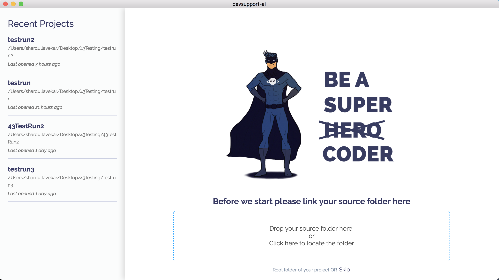

# Getting Started

At Peach Payments, we are committed to offer a seamless integration experience to our developers.

We are happy to launch Devsupport AI - a bot programmer that integrates our Android SDK with your code in few minutes.

!!! info "Sandbox Integration"
	At the end of this integration, you can test payments on our Sandbox Environment. Note that Sandbox and Production credentails are different.

## What do I need?

* User Id
* Password
* Entity Id
* A Backend Server 


!!! tip "Server Script"
    We currently support PHP on the back end server. If you use any other back end technology, check [other back end techs.](https://peachpayments.devsupport.ai/othertechs/)


Get your Entity Id from [Peach Payments Dashboard](test.ppay.io "Peach Payments Dashboard")

## Steps

*You will first complete your back end integration, host the files Devsupport AI tool gives you and keep their publicly available URLs ready.*

* [Download the Devsupport AI](https://github.com/artpar/devsupport/releases/latest). tool. Install the .exe if you are on Windows, mac.zip if you are on Mac and .deb if you are on Linux. You should see a screen below:
  
 
* Link the home directory of your Android project.
  

* Click on Integrate button.

* Search for Peachpayments when asked for Product you'd like to integrate.

* If you are using PHP, select 'PHP for mobile SDK'. If you are using some other back end technology, check [other back end techs.](https://peachpayments.devsupport.ai othertechs/)

* Enter your User Id, Password and Entity Id. If you enter wrong key combination, the tool will throw an error!

* Download the notify.php and host it on your server. Keep it's URL ready.

* Enter the publicly available URL for the notify.php you just downloaded and also enter your company name(without spaces).
It will be used for callback.

* Download the action.php, host it and give its URL in next step.

**Note that both notify.php and action.php contain your Sandbox Credentials. DO NOT Modify them.**

* If everything went well, you should see a success screen like this:
  

* Proceed to Android Integration to complete the flow.

* Enter the URL to the action.php you just downloaded. 

* Devsupport AI will show you a list of injections the bot will do.

* Apply changes and if everything went well, you should see a screen like this:


!!! danger "Keep your credentials safe"
	Devsupport AI tool doesn't store your credentials. You are responsible for your credentials. Keep them safe!


## Initiating Payments

In the activity you selected and just call callPeachPayments as shown below:

`callPeachPayments(amount, currency, payment_type, env);`

for e.g.

* `callPeachPayments("95.00", "EUR", "DB", Config.TEST);` for Debit payment on test.

* `callPeachPayments("95.00", "EUR", "PA", Config.PROD);` for Preauthorization payment on production.

You will receive a call back on the below function:

````
private void initListener() {
            peachListener = new PeachListener() {
                @Override
                public void onSuccess(String response) {
                    Toast.makeText(getApplicationContext(), "Success:" + response, Toast.LENGTH_LONG)
                            .show();
                }
    
                @Override
                public void onFailure(int code, String reason) {
                    Toast.makeText(getApplicationContext(), "Failed Reason:" + reason, Toast.LENGTH_LONG)
                            .show();
                }
            };
        }
````

### Response Format

status=success:idontKNOW:(


## Switching to Production

Get your production credentials from [Production Peach Payments dashboard](https://www.ppay.io/merchant/#/index).

Change the following in action.php and notify.php:

* Change URL from "https://test.oppwa.com/" to "https://oppwa.com/".

* Change User Id to Production User Id.

* Change Password to Production Password.

* Change Entity Id to Production Entity Id.

!!! success
	Congrats! You just completed integrating our SDK. If you need help, you can chat with us using the orange icon on the tool or write us an email at support@devsupport.ai - happy to help!
